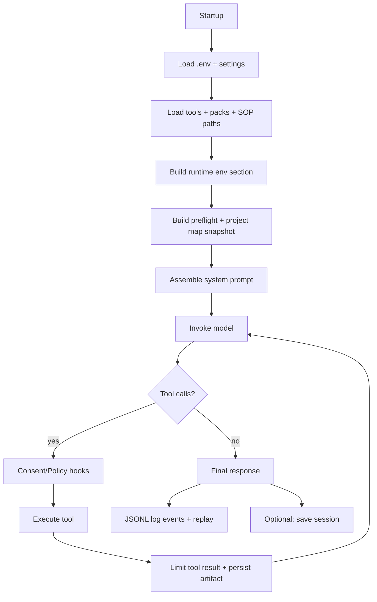

# Agent context lifecycle (end-to-end)

This document explains how **Swarmee River** builds, manages, trims, persists, and replays “agent context” from session startup through execution and shutdown. It also points to the **exact code/config locations** to tune performance and context quality.

## At a glance

The orchestrator is a single Strands `Agent` whose *effective context* is the combination of:

- **System prompt** (env / `.prompt` / default)
- **Injected prompt sections** (runtime environment, packs, project map, preflight snapshot, active SOP, active plan)
- **Conversation history** (managed by a conversation manager: summarize/sliding/none)
- **Tool results** (optionally truncated + persisted to artifacts)

High-level flow:

## 1) What context is loaded on session startup? Where is it configured?

### Configuration precedence (what “wins”)

Swarmee’s configuration is intentionally layered. The broad precedence is:

1. **CLI flags**
2. **Environment variables** (including `.env`)
3. **Project settings**: `.swarmee/settings.json`
4. **Packaged defaults**

Key entrypoints:
- Startup/CLI wiring: `src/swarmee_river/swarmee.py`
- Project settings loader + built-in defaults: `src/swarmee_river/settings.py`
- `.env` loader: `src/swarmee_river/utils/env_utils.py`

### Startup inputs that become “context”

On startup, Swarmee builds the following “context sources”, some of which are displayed to the user and some injected into the system prompt:

1) **Environment (.env + process env)**
- Loaded early via `load_env_file()` in `src/swarmee_river/swarmee.py`.
- This is where most context-management knobs live (see `env.example`).

2) **Project settings (`.swarmee/settings.json`)**
- Loaded via `load_settings()` in `src/swarmee_river/settings.py`.
- Contains defaults/overrides for:
  - model tiers/providers
  - safety consent defaults + tool rules
  - enabled packs
  - tier harness profiles (preflight defaults; optional tool allow/block lists)

3) **System prompt**
- Loaded via `load_system_prompt()` in `src/swarmee_river/utils/kb_utils.py`.
- Priority:
  1. `SWARMEE_SYSTEM_PROMPT` (or `STRANDS_SYSTEM_PROMPT`)
  2. `.prompt` in the current working directory
  3. fallback `"You are a helpful assistant."`

4) **Runtime environment prompt section**
- Computed via `detect_runtime_environment()` + rendered via `render_runtime_environment_section()` in `src/swarmee_river/runtime_env.py`.
- Injected into the system prompt (so the model adapts shell/OS behavior).

5) **Pack prompt sections + pack tools + pack SOPs**
- Packs are configured via `.swarmee/settings.json` (`packs.installed`).
- Pack system prompt sections are loaded via `enabled_system_prompts()` in `src/swarmee_river/packs.py`.
- Pack tools are loaded via `load_enabled_pack_tools()` in `src/swarmee_river/packs.py`.
- Pack SOP directories are added via `enabled_sop_paths()` in `src/swarmee_river/packs.py`.

6) **Preflight “context snapshot” (repo summary / tree / files)**
- Built by `build_context_snapshot()` in `src/swarmee_river/project_map.py`.
- Controlled via env vars:
  - `SWARMEE_PREFLIGHT=enabled|disabled`
  - `SWARMEE_PREFLIGHT_LEVEL=summary|summary+tree|summary+files`
  - `SWARMEE_PREFLIGHT_MAX_CHARS`
  - `SWARMEE_PREFLIGHT_PRINT=enabled|disabled` (interactive printing only)
- Tier defaults for `SWARMEE_PREFLIGHT_LEVEL` come from `harness.tier_profiles[*].preflight_level` in `src/swarmee_river/settings.py`.
- Implementation uses `run_project_context()` in `tools/project_context.py`.
- The snapshot text is also persisted to artifacts as `kind="context_snapshot"` via `src/swarmee_river/artifacts.py`.

7) **Project map**
- Built alongside preflight in `src/swarmee_river/project_map.py`.
- Controlled via `SWARMEE_PROJECT_MAP=enabled|disabled`.
- Generated by `src/swarmee_river/project_map.py` and cached under `<state_dir>/project_map.json` (default `.swarmee/project_map.json`).
- A short summary is injected into the system prompt.

8) **Welcome text**
- Rendered to the console at interactive startup via `tools/welcome.py` (reads `.welcome` or uses a built-in default).
- Not injected into the system prompt unless `--include-welcome-in-prompt` is set (this is intentionally discouraged for large welcome text).

### Where to optimize startup context (performance pointers)

- Preflight snapshot content + size: `src/swarmee_river/project_map.py`
- Repo summary/tree/files/search/read behavior: `tools/project_context.py`
- Project map detection limits and skip dirs: `src/swarmee_river/project_map.py`
- Default tier → preflight depth mapping: `src/swarmee_river/settings.py`

## 2) Default orchestrator agent: tools + prompt + override points

### The orchestrator agent

The orchestrator is created in `src/swarmee_river/swarmee.py` via Strands `Agent(...)` with:

- `model`: selected by provider/tier via `src/swarmee_river/session/models.py`
- `tools`: assembled from core tools + pack tools
- `system_prompt`: dynamically rebuilt by `refresh_system_prompt(...)`
- `conversation_manager`: chosen by `_build_conversation_manager(...)` (summarize/sliding/none)
- `hooks`: logging + tool policy + tool consent + tool result limiting

### Effective system prompt (how it’s assembled)

`refresh_system_prompt(...)` in `src/swarmee_river/swarmee.py` composes the final system prompt in this order:

1) Base system prompt (`load_system_prompt()`)
2) Built-in tool usage rules (the `_TOOL_USAGE_RULES` string)
3) Runtime environment section
4) Pack system prompts (enabled packs)
5) Project map section (if enabled)
6) Preflight snapshot section (if enabled)
7) Optional welcome text (only if `--include-welcome-in-prompt`)
8) Active SOP contents (if an SOP is active)
9) Active approved plan (during execute-with-plan only)

### Default tools (what’s available “out of the box”)

The tool registry is built in `src/swarmee_river/tools.py::get_tools()`:

1) **Strands Tools** (if installed): attempts to import individual tools from the optional `strands_tools` module.
2) **Cross-platform fallbacks**: local implementations used when Strands Tools aren’t present (e.g., `shell`, `editor`, `file_write`, `python_repl`, etc.).
3) **Packaged custom tools**: repository-focused primitives such as:
   - `file_list`, `file_search`, `file_read` (`tools/file_ops.py`)
   - `git` (`tools/git.py`)
   - `patch_apply` (`tools/patch_apply.py`)
   - `artifact` (`tools/artifact.py`)
   - `run_checks` (`tools/run_checks.py`)
   - `todoread` / `todowrite` (`tools/todo.py`)
   - `sop` (`tools/sop.py`)
   - `store_in_kb` (`tools/store_in_kb.py`)
   - multi-agent delegation tools like `use_agent`, `swarm`, `strand` (see below)
4) **OpenCode-compatible aliases**: `grep/read/bash/patch/write/edit` mapped to canonical tools in `src/swarmee_river/opencode_aliases.py`.

Notes:
- Tool availability can vary by platform and optional dependencies.
- You can list the *effective* tool set in-session with `:tools` (implemented in `src/swarmee_river/cli/builtin_commands.py`).

### How defaults are overridden

There are multiple “override surfaces”, depending on what you’re trying to change:

- **System prompt**: set `SWARMEE_SYSTEM_PROMPT` or edit `.prompt` (loaded by `load_system_prompt()`).
- **Add tools/prompts/SOPs**: install/enable packs via `.swarmee/settings.json` (`packs.installed`) and `src/swarmee_river/packs.py`.
- **Tool consent defaults**: edit `.swarmee/settings.json` under `safety`.
  `tool_rules` + `tool_consent` provide legacy defaults and prompting behavior (enforced by `src/swarmee_river/hooks/tool_consent.py`).
- **Tool allow/block policies**:
  - declarative layer: `safety.permission_rules` (`allow`/`ask`/`deny` with basic patterns; hard `deny` enforced by `src/swarmee_river/hooks/tool_policy.py`)
  - global: `SWARMEE_ENABLE_TOOLS`, `SWARMEE_DISABLE_TOOLS`, `SWARMEE_SWARM_ENABLED` (`src/swarmee_river/hooks/tool_policy.py`)
  - tier-specific: `harness.tier_profiles[*].tool_allowlist` / `tool_blocklist` (`src/swarmee_river/settings.py`)
- **Startup context depth**: tier profiles (`.swarmee/settings.json`) and/or `SWARMEE_PREFLIGHT_*` env vars.

## 3) Logging, replay, and summarization (where context gets trimmed)

### JSONL event logs (activity tracking + replay)

When Strands hooks are available, Swarmee enables JSONL logging by default:

- Hook: `src/swarmee_river/hooks/jsonl_logger.py::JSONLLoggerHooks`
- Storage: `<state_dir>/logs/*.jsonl` (default `.swarmee/logs/`), resolved via `src/swarmee_river/state_paths.py`
- Key identifiers:
  - `session_id`: set by `SWARMEE_SESSION_ID` or generated automatically
  - `invocation_id`: unique per model invocation (written into `invocation_state["swarmee"]`)

Controls (see `env.example`):
- `SWARMEE_LOG_EVENTS=true|false`
- `SWARMEE_LOG_DIR=...`
- `SWARMEE_LOG_MAX_FIELD_CHARS=...`
- `SWARMEE_LOG_REDACT=true|false`
- Optional S3 upload: `SWARMEE_LOG_S3_BUCKET`, `SWARMEE_LOG_S3_PREFIX`

Replay UX:
- `:log tail` shows the latest log file tail (`src/swarmee_river/cli/diagnostics.py::render_log_tail`)
- `:replay <invocation_id>` reconstructs the sequence of logged events (`src/swarmee_river/cli/diagnostics.py::render_replay_invocation`)

### Conversation summarization / history management

Swarmee chooses a conversation manager in `_build_conversation_manager(...)` (`src/swarmee_river/swarmee.py`) via:

- `SWARMEE_CONTEXT_MANAGER=summarize|sliding|none`

Summarizing manager (recommended default):
- Implementation: `src/swarmee_river/context/budgeted_summarizing_conversation_manager.py`
- Key knobs:
  - `SWARMEE_CONTEXT_BUDGET_TOKENS` (prompt budget estimate)
  - `SWARMEE_SUMMARY_RATIO` (how aggressively to summarize)
  - `SWARMEE_PRESERVE_RECENT_MESSAGES` (keep recent turns verbatim)
  - `SWARMEE_MAX_SUMMARY_PASSES`, `SWARMEE_TOKEN_CHARS_PER_TOKEN`
  - `SWARMEE_SUMMARIZE_CONTEXT=true|false`

Sliding window manager:
- Uses Strands `SlidingWindowConversationManager` with:
  - `SWARMEE_WINDOW_SIZE`
  - `SWARMEE_CONTEXT_PER_TURN` (max items dropped per truncation)
  - `SWARMEE_TRUNCATE_RESULTS=true|false`

### Tool result limiting (prevent tool output from bloating the prompt)

Tool results are often the #1 driver of runaway context. Swarmee mitigates this with:

- Hook: `src/swarmee_river/hooks/tool_result_limiter.py::ToolResultLimiterHooks`
- Behavior: truncates large `toolResult` text *before* it is added to the conversation, and writes the full output to an artifact file.

Controls:
- `SWARMEE_LIMIT_TOOL_RESULTS=true|false`
- `SWARMEE_TOOL_RESULT_MAX_CHARS=...`

Where the “full output” goes:
- `<state_dir>/artifacts/` (default `.swarmee/artifacts/`)
- Indexed by `src/swarmee_river/artifacts.py` (`index.jsonl`)
- Viewable via `:artifact list` / `:artifact get ...` (CLI) or the `artifact` tool (`tools/artifact.py`)

## 4) Modes (plan/execute), delegation, and selective tool invocation

### Where “modes” are defined

Swarmee primarily uses two operational modes recorded in `invocation_state["swarmee"]["mode"]`:

- `plan`: structured planning only (no mutation)
- `execute`: normal agent behavior (tool calls permitted)

Planning schema + prompt:
- `src/swarmee_river/planning.py` (`WorkPlan`, `structured_plan_prompt()`)

Intent routing (when to plan):
- Heuristic classifier: `src/swarmee_river/intent.py`
- Manual: `:plan` forces plan-first for the next prompt (`src/swarmee_river/cli/builtin_commands.py`)

### Plan mode guardrails (read-only by default)

Tool gating in plan mode is enforced by:
- `src/swarmee_river/hooks/tool_policy.py::ToolPolicyHooks`

Key behaviors:
- In `mode == "plan"`, only an allowlist of “inspection” tools is permitted by default (file read/list/search, SOP retrieval, etc.).
- `project_context` is allowed in plan mode only for a limited set of actions (summary/files/tree/search/read/git_status).

### Execute mode with “approved plan enforcement”

When you approve a plan, Swarmee executes with:
- `enforce_plan=true`
- an `allowed_tools` allowlist derived from `tools_expected` fields in the plan

Extraction logic:
- `src/swarmee_river/artifacts.py::tools_expected_from_plan(...)`

Enforcement:
- `src/swarmee_river/hooks/tool_policy.py` blocks tools not in the approved allowlist.

Consent integration:
- `src/swarmee_river/hooks/tool_consent.py` treats plan approval as consent for tools explicitly listed in the approved plan.

### Delegation options (save context space in the main thread)

The best way to “save context” is to push work into *sub-invocations that return a small summary* instead of streaming large intermediate context into the main conversation.

Available delegation surfaces:

1) `use_agent` / `use_llm` (summary-only, tool-less)
- Fallback tool in `tools/use_agent.py`
- Creates a tool-less sub-agent and returns only extracted text.
- Use for: analysis, summarization, rewriting, diff review, “explain this” without repo mutation.

2) `strand` (nested agent with a selectable tool set)
- Tool in `tools/strand.py`
- You can restrict `tool_names` to a minimal set to avoid tool sprawl.

3) `swarm` (multi-agent collaboration)
- Tool in `tools/swarm.py`
- Useful when tasks split naturally (investigation vs implementation vs testing), but be mindful: it can increase total token usage if agents are not tightly scoped.

### More selective tool invocation (policy + ergonomics)

You can make tool use more selective (and cheaper/faster) via:

- **Environment policy**: `SWARMEE_ENABLE_TOOLS` / `SWARMEE_DISABLE_TOOLS` (`src/swarmee_river/hooks/tool_policy.py`)
- **Tier profiles**: `harness.tier_profiles[*].tool_allowlist` / `tool_blocklist` (`src/swarmee_river/settings.py`)
- **Plan enforcement**: include only necessary tools in `WorkPlan.steps[*].tools_expected` so execute mode stays narrow
- **Alias normalization**: OpenCode-style aliases map to canonical tools (`src/swarmee_river/opencode_aliases.py`)

## 5) Evaluating results + capturing key takeaways for future runs

Swarmee has several “persistence sinks” you can use to retain outcomes and reduce future context needs:

### Local artifacts (best for large outputs)

- Store plans, context snapshots, tool outputs, and check outputs under `<state_dir>/artifacts/`
- Code: `src/swarmee_river/artifacts.py` + `tools/artifact.py`

Examples already persisted by default:
- Context snapshot text: `src/swarmee_river/project_map.py`
- Structured plan JSON: `src/swarmee_river/swarmee.py` (during plan generation)
- Large tool outputs: `src/swarmee_river/hooks/tool_result_limiter.py`
- Long test/lint output: `tools/run_checks.py`

### Project-local TODOs (lightweight “next steps” memory)

- `todoread` / `todowrite` tools persist to `<state_dir>/todo.md` (default `.swarmee/todo.md`)
- Code: `tools/todo.py` + `src/swarmee_river/state_paths.py`

### SOPs (codified process memory)

- SOPs can live in `./sops/*.sop.md` or in pack SOP directories, and can optionally be loaded from `strands_agents_sops` if installed.
- Code: `tools/sop.py`
- You can enforce/limit SOP availability via `SWARMEE_ENABLE_SOPS` / `SWARMEE_DISABLE_SOPS`.

### Knowledge base (long-term cross-session memory)

If you run with `--kb <ID>` (or set `SWARMEE_KNOWLEDGE_BASE_ID` / `STRANDS_KNOWLEDGE_BASE_ID`):

- Retrieval may be attempted for one-shot queries (`src/swarmee_river/swarmee.py`).
- Conversations and approved plans can be stored via:
  - `src/swarmee_river/utils/kb_utils.py::store_conversation_in_kb`
  - `tools/store_in_kb.py` / `tools/artifact.py (store_in_kb action)`

### Where to add automated “evaluation” hooks

If you want automatic “key takeaways extraction” after each invocation (e.g., write a short summary artifact, update TODOs, store a KB note), the clean integration point is:

- A new Strands hook that runs on `AfterInvocationEvent` (pattern: `src/swarmee_river/hooks/jsonl_logger.py`)

This keeps evaluation logic **out of the main prompt** and avoids repeated explanation overhead.

## 6) Clearing context, saving it, and resuming previous sessions

### Session persistence (messages + state + last plan)

Swarmee supports project-local sessions under:

- `<state_dir>/sessions/<session_id>/` (default `.swarmee/sessions/`)

Storage format:
- `meta.json`, `messages.json`, `state.json`, `last_plan.json`

Code:
- `src/swarmee_river/session/store.py::SessionStore`
- REPL commands: `:session new|save|load|list|rm|info` (`src/swarmee_river/cli/builtin_commands.py`)

Behavioral notes:
- `:session new` resets the orchestrator’s messages/state and clears pending plan state.
- `:session save` snapshots current `agent.messages` and `agent.state` so context can be resumed exactly.
- `:session load <id>` restores messages/state (and last plan) and rebuilds the orchestrator agent.

### Clearing context at the end of a task

Options, from “least destructive” to “most destructive”:

1) Start a fresh session: `:session new`
2) Save and exit: `:session save` then `:exit`
3) Delete a session: `:session rm <id>`
4) Clear project-local state entirely by deleting `<state_dir>/` (default `.swarmee/`) if you explicitly want a clean slate

### Relocating state (logs/artifacts/sessions/project map/todo)

All project-local state roots at:
- `<state_dir>` (default `.swarmee/`)
- Override with `SWARMEE_STATE_DIR` (absolute or relative)

Resolver:
- `src/swarmee_river/state_paths.py`

## Performance playbook (where to look first)

If you’re improving “context performance”, these are the highest-leverage areas:

1) **Prompt size / startup injections**
- Keep `.prompt` small (it is injected verbatim).
- Reduce/disable preflight (`SWARMEE_PREFLIGHT_*`) and project map (`SWARMEE_PROJECT_MAP`) if they’re too noisy.

2) **Tool output bloat**
- Keep `SWARMEE_LIMIT_TOOL_RESULTS=true` and tune `SWARMEE_TOOL_RESULT_MAX_CHARS`.
- Persist large outputs to artifacts and reference them instead of re-pasting.
- Enforce “no shell for repo inspection” behavior (already guarded by `src/swarmee_river/hooks/tool_policy.py`).

3) **Conversation growth**
- Prefer `SWARMEE_CONTEXT_MANAGER=summarize` and tune the summarization budget knobs.
- Increase `SWARMEE_PRESERVE_RECENT_MESSAGES` if summarization is too aggressive.

4) **Selective tools**
- Use plan enforcement (`tools_expected`) to narrow allowed tools during execution.
- Use `SWARMEE_ENABLE_TOOLS` / `SWARMEE_DISABLE_TOOLS` to prevent accidental tool sprawl.
