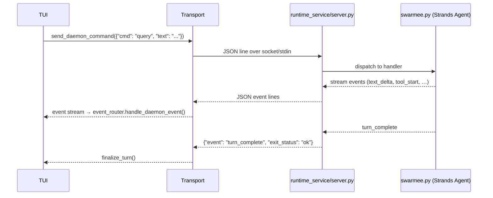
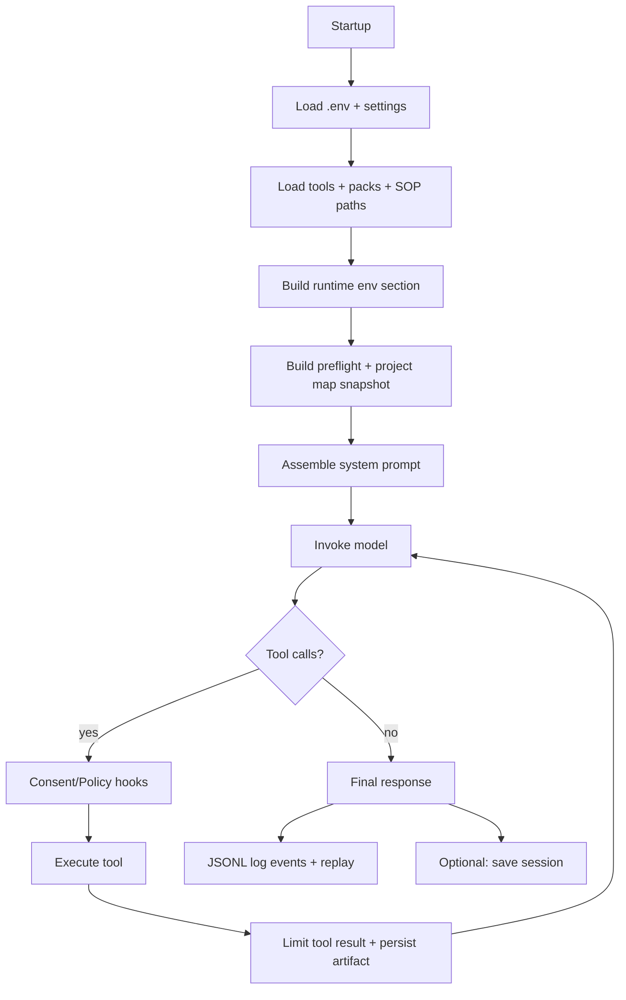

# Agent context lifecycle (end-to-end)

This document explains how **Swarmee River** builds, manages, trims, persists, and replays "agent context" from session startup through execution and shutdown. It also points to the **exact code/config locations** to tune performance and context quality.

## 0) Runtime architecture

Swarmee River has a **two-process model** when running through the TUI.

```
┌───────────────────────────────────┐     commands (JSON lines)     ┌──────────────────────────────────────┐
│  TUI  (swarmee_river/tui/app.py)  │ ────────────────────────────► │  Daemon (runtime_service/server.py   │
│  Textual terminal UI client       │ ◄────────────────────────────  │          → swarmee.py orchestrator)  │
└───────────────────────────────────┘     events  (JSON lines)      └──────────────────────────────────────┘
```

- **Daemon**: runs the Strands `Agent` orchestrator, processes commands, streams JSON events to all attached clients. Entry point: `src/swarmee_river/runtime_service/server.py` → `src/swarmee_river/swarmee.py`.
- **TUI**: renders the terminal UI, sends commands via the transport layer, and processes the event stream. Entry point: `src/swarmee_river/tui/app.py`.
- **Transport layer** (`src/swarmee_river/tui/transport.py`): uses `_SocketTransport` if a runtime broker is already running, otherwise spawns a `_SubprocessTransport`. Multiple TUI clients can attach to a shared broker session simultaneously.


```mermaid
sequenceDiagram
    participant TUI
    participant Transport
    participant Server as runtime_service/server.py
    participant Agent as swarmee.py (Strands Agent)

    TUI->>Transport: send_daemon_command({"cmd": "query", "text": "..."})
    Transport->>Server: JSON line over socket/stdin
    Server->>Agent: dispatch to handler
    Agent-->>Server: stream events (text_delta, tool_start, …)
    Server-->>Transport: JSON event lines
    Transport-->>TUI: event stream → event_router.handle_daemon_event()
    Agent-->>Server: turn_complete
    Server-->>Transport: {"event": "turn_complete", "exit_status": "ok"}
    Transport-->>TUI: finalize_turn()
```

### Context sync on daemon ready

When the daemon first becomes ready (on `ready` or `attached` event), the TUI pushes any pending context sources and active SOPs:

```
attached/ready event received
  → if _context_sources or _context_ready_for_sync:
        _sync_context_sources_with_daemon()    # sends set_context_sources
  → if _active_sop_names or _sops_ready_for_sync:
        _sync_active_sops_with_daemon()        # sends set_sop
```

Flags (`_context_ready_for_sync`, `_sops_ready_for_sync`) track whether unsynced state exists. Defined in `src/swarmee_river/tui/mixins/daemon.py`; consumed in `src/swarmee_river/tui/event_router.py`.

---

## TUI ↔ Daemon protocol reference

### Commands (TUI → Daemon)

Source: `src/swarmee_river/tui/mixins/daemon.py`, `mixins/agent_studio.py`, `mixins/context_sources.py`, `mixins/output.py`. Accepted by `src/swarmee_river/runtime_service/server.py`.

| `cmd` | Key fields | Effect |
|---|---|---|
| `query` | `text`, `auto_approve`, `tier?`, `mode?` | Execute a prompt |
| `interrupt` | — | Stop active run |
| `set_profile` | `profile` (AgentProfile dict) | Apply agent profile (see §Agent Profiles) |
| `set_context_sources` | `sources` (list of source dicts) | Replace active context injection |
| `set_sop` | `name`, `content` | Add/update one active SOP |
| `set_safety_overrides` | `tool_consent?`, `tool_allowlist?`, `tool_blocklist?` | Session-scoped policy overrides |
| `set_tier` | `tier` | Escalate to a different model tier |
| `compact` | — | Summarize/compact conversation context |
| `restore_session` | `session_id` | Load a previous session from disk |
| `connect` | `provider`, `profile?` | Trigger provider auth flow |
| `auth` | `action` | List or revoke provider credentials |
| `consent_response` | `choice` | Respond to a consent prompt (y/n/a/v) |
| `hello` | — | Handshake on new connection |
| `attach` | — | Attach additional client to shared session |
| `ping` | — | Health check |
| `shutdown_session` | — | Stop the current session |
| `shutdown_service` | — | Stop the runtime broker entirely |

### Events (Daemon → TUI)

Source: `src/swarmee_river/tui/event_router.py`. Handler: `handle_daemon_event()`.

| `event` | Key fields | TUI action |
|---|---|---|
| `ready` | — | Trigger context/SOP sync |
| `attached` | `clients` | Log shared session message + trigger sync |
| `session_available` | `session_id`, `turn_count` | Offer session restore prompt |
| `session_restored` | `session_id`, `turn_count` | Log restore confirmation |
| `replay_turn` | `role`, `text`, `timestamp` | Render restored turn |
| `replay_complete` | — | Finalize session restore |
| `turn_complete` | `exit_status` | `_finalize_turn()` |
| `model_info` | `provider`, `tier`, `model`, `model_id` | Update model selector |
| `profile_applied` | `profile` | Refresh Agent Studio UI |
| `safety_overrides` | `overrides` | Refresh policy lens display |
| `context` | `prompt_tokens`, `budget_tokens` | Update context budget bar |
| `usage` | `input_tokens`, `output_tokens` | Usage tracking |
| `compact_complete` | `summary` | Log compaction summary |
| `text_delta` / `message_delta` / `delta` | `text` | Stream assistant text |
| `text_complete` / `message_complete` / `complete` | `text` | Finalize assistant message |
| `thinking` | `thinking` | Display reasoning block |
| `tool_start` | `tool_use_id`, `tool_name`, `input` | Render tool call widget |
| `tool_progress` | `tool_use_id`, `content`, `stream` | Accumulate tool output |
| `tool_input` | `tool_use_id`, `tool_name`, `input` | Late-arriving tool input |
| `tool_result` | `tool_use_id`, `status`, `duration_s` | Render tool result line |
| `consent_prompt` | `context`, `options` | Show consent UI |
| `plan` | `plan` (JSON) | Render plan panel |
| `plan_step_update` | `step_index`, `status` | Update plan step status |
| `plan_complete` | — | Finalize plan view |
| `artifact` | `path`, `kind` | Add to artifacts panel |
| `error` | `error_type`, `message`, `…` | Classify and display error |
| `warning` | `message` | Show warning toast |

---

## At a glance

When running via the TUI, the **daemon's** orchestrator is a single Strands `Agent` whose *effective context* is the combination of:

- **System prompt** (orchestrator prompt asset + profile snippets + SOP content)
- **Injected prompt sections** (runtime environment, packs, project map, preflight snapshot, active plan)
- **Conversation history** (managed by a tool-aware context strategy that preserves reasoning, tool state, and artifacts during compaction)
- **Tool results** (optionally truncated + persisted to artifacts)

High-level flow:


```mermaid
flowchart TD
  A[Startup] --> B[Load .env + settings]
  B --> C[Load tools + packs + SOP paths]
  C --> D[Build runtime env section]
  D --> E[Build preflight + project map snapshot]
  E --> F[Assemble system prompt]
  F --> G[Invoke model]
  G --> H{Tool calls?}
  H -->|yes| I[Consent/Policy hooks]
  I --> J[Execute tool]
  J --> K[Limit tool result + persist artifact]
  K --> G
  H -->|no| L[Final response]
  L --> M[JSONL log events + replay]
  L --> N[Optional: save session]
```

## 1) What context is loaded on session startup? Where is it configured?

### Configuration precedence (what "wins")

Swarmee's configuration is intentionally layered. The broad precedence is:

1. **CLI flags**
2. **Environment variables** (including `.env`)
3. **Project settings**: `.swarmee/settings.json`
4. **Packaged defaults**

Key entrypoints:
- Startup/CLI wiring: `src/swarmee_river/swarmee.py`
- Project settings loader + built-in defaults: `src/swarmee_river/settings.py`
- `.env` loader: `src/swarmee_river/utils/env_utils.py`

### Startup inputs that become "context"

On startup, Swarmee builds the following "context sources", some of which are displayed to the user and some injected into the system prompt:

1) **Environment (.env + process env)**
- Loaded early via `load_env_file()` in `src/swarmee_river/swarmee.py`.
- This is where most context-management knobs live (see `env.example`).

2) **Project settings (`.swarmee/settings.json`)**
- Loaded via `load_settings()` in `src/swarmee_river/settings.py`.
- Contains defaults/overrides for:
  - model tiers/providers
  - safety consent defaults + tool rules
  - enabled packs
  - tier harness profiles (preflight defaults; optional tool allow/block lists)

3) **System prompt**
- Loaded via `load_system_prompt()` in `src/swarmee_river/utils/kb_utils.py`.
- Source:
  1. Prompt assets referenced by the reserved `orchestrator` agent row (`prompt_refs`, then inline `prompt`)
  2. fallback prompt asset `orchestrator_base`
  3. fallback `"You are a helpful assistant."`

4) **Runtime environment prompt section**
- Computed via `detect_runtime_environment()` + rendered via `render_runtime_environment_section()` in `src/swarmee_river/runtime_env.py`.
- Injected into the system prompt (so the model adapts shell/OS behavior).

5) **Pack prompt sections + pack tools + pack SOPs**
- Packs are configured via `.swarmee/settings.json` (`packs.installed`).
- Pack system prompt sections are loaded via `enabled_system_prompts()` in `src/swarmee_river/packs.py`.
- Pack tools are loaded via `load_enabled_pack_tools()` in `src/swarmee_river/packs.py`.
- Pack SOP directories are added via `enabled_sop_paths()` in `src/swarmee_river/packs.py`.

6) **Preflight "context snapshot" (repo summary / tree / files)**
- Built by `build_context_snapshot()` in `src/swarmee_river/project_map.py`.
- Controlled via env vars:
  - `SWARMEE_PREFLIGHT=enabled|disabled`
  - `SWARMEE_PREFLIGHT_LEVEL=summary|summary+tree|summary+files`
  - `SWARMEE_PREFLIGHT_MAX_CHARS`
  - `SWARMEE_PREFLIGHT_PRINT=enabled|disabled` (interactive printing only)
- Tier defaults for `SWARMEE_PREFLIGHT_LEVEL` come from `harness.tier_profiles[*].preflight_level` in `src/swarmee_river/settings.py`.
- Implementation uses `run_project_context()` in `tools/project_context.py`.
- The snapshot text is also persisted to artifacts as `kind="context_snapshot"` via `src/swarmee_river/artifacts.py`.

7) **Project map**
- Built alongside preflight in `src/swarmee_river/project_map.py`.
- Controlled via `SWARMEE_PROJECT_MAP=enabled|disabled`.
- Generated by `src/swarmee_river/project_map.py` and cached under `<state_dir>/project_map.json` (default `.swarmee/project_map.json`).
- A short summary is injected into the system prompt.

8) **Welcome text**
- Rendered to the console at interactive startup via `tools/welcome.py` (reads `.welcome` or uses a built-in default).
- Not injected into the system prompt unless `--include-welcome-in-prompt` is set (this is intentionally discouraged for large welcome text).

**TUI note**: when running via the TUI, context sources and active SOPs are not passed at process startup. Instead they are pushed to the daemon after it is ready via `set_context_sources` and `set_sop` commands (see §0).

### Where to optimize startup context (performance pointers)

- Preflight snapshot content + size: `src/swarmee_river/project_map.py`
- Repo summary/tree/files/search/read behavior: `tools/project_context.py`
- Project map detection limits and skip dirs: `src/swarmee_river/project_map.py`
- Default tier → preflight depth mapping: `src/swarmee_river/settings.py`

## 2) Default orchestrator agent: tools + prompt + override points

### The orchestrator agent

The orchestrator is created in `src/swarmee_river/swarmee.py` via Strands `Agent(...)` with:

- `model`: selected by provider/tier via `src/swarmee_river/session/models.py`
- `tools`: assembled from core tools + pack tools
- `system_prompt`: dynamically rebuilt by `refresh_system_prompt(...)`
- `conversation_manager`: built by `_build_conversation_manager(...)` from the selected context strategy and compaction mode
- `hooks`: logging + tool policy + tool consent + tool result limiting

### Effective system prompt (how it's assembled)

`refresh_system_prompt(...)` in `src/swarmee_river/swarmee.py` composes the final system prompt in this order:

1) Base system prompt (resolved from prompt assets via `load_system_prompt()`)
2) Built-in tool usage rules (the `_TOOL_USAGE_RULES` string)
3) Runtime environment section
4) Pack system prompts (enabled packs)
5) Project map section (if enabled)
6) Preflight snapshot section (if enabled)
7) Optional welcome text (only if `--include-welcome-in-prompt`)
8) Active SOP contents (if an SOP is active)
9) Active profile system prompt snippets (if a profile is applied)
10) Active approved plan (during execute-with-plan only)

### Default tools (what's available "out of the box")

The tool registry is built in `src/swarmee_river/tools.py::get_tools()`:

1) **Strands Tools** (if installed): attempts to import individual tools from the optional `strands_tools` module.
2) **Cross-platform fallbacks**: local implementations used when Strands Tools aren't present (e.g., `shell`, `editor`, `python_repl`, etc.).
3) **Packaged custom tools**: repository-focused primitives such as:
   - `file_list`, `file_search`, `file_read` (`tools/file_ops.py`)
   - `git` (`tools/git.py`)
   - `patch_apply` (`tools/patch_apply.py`)
   - `artifact` (`tools/artifact.py`)
   - `run_checks` (`tools/run_checks.py`)
   - `todoread` / `todowrite` (`tools/todo.py`)
   - `sop` (`tools/sop.py`)
   - `store_in_kb` (`tools/store_in_kb.py`)
   - multi-agent delegation tools like `use_agent`, `swarm`, `strand` (see below)

Notes:
- Tool availability can vary by platform and optional dependencies.
- You can list the *effective* tool set in-session with `:tools` (implemented in `src/swarmee_river/cli/builtin_commands.py`).
- Preferred coding loop: `file_list` / `file_search` / `file_read` -> `editor` or `patch_apply` -> `run_checks`

### How defaults are overridden

There are multiple "override surfaces", depending on what you're trying to change:

- **System prompt**: manage prompt assets in `Tooling > Prompts`; assign orchestrator prompt refs from the reserved Orchestrator row in `Agents > Builder`.
- **Add tools/prompts/SOPs**: install/enable packs via `.swarmee/settings.json` (`packs.installed`) and `src/swarmee_river/packs.py`.
- **Tool consent defaults**: edit `.swarmee/settings.json` under `safety`.
  `tool_rules` + `tool_consent` provide legacy defaults and prompting behavior (enforced by `src/swarmee_river/hooks/tool_consent.py`).
- **Tool allow/block policies**:
  - declarative layer: `safety.permission_rules` (`allow`/`ask`/`deny` with basic patterns; hard `deny` enforced by `src/swarmee_river/hooks/tool_policy.py`)
  - global: `SWARMEE_ENABLE_TOOLS`, `SWARMEE_DISABLE_TOOLS`, `SWARMEE_SWARM_ENABLED` (`src/swarmee_river/hooks/tool_policy.py`)
  - tier-specific: `harness.tier_profiles[*].tool_allowlist` / `tool_blocklist` (`src/swarmee_river/settings.py`)
  - **session-scoped (TUI)**: `set_safety_overrides` command — ephemeral overrides for `tool_consent`, `tool_allowlist`, `tool_blocklist`. Applied by `apply_session_safety_overrides()` in `swarmee.py`. Cleared on Reset or session end. These take precedence over tier defaults.
- **Startup context depth**: tier profiles (`.swarmee/settings.json`) and/or `SWARMEE_PREFLIGHT_*` env vars.

## 3) Logging, replay, and summarization (where context gets trimmed)

### JSONL event logs (activity tracking + replay)

When Strands hooks are available, Swarmee enables JSONL logging by default:

- Hook: `src/swarmee_river/hooks/jsonl_logger.py::JSONLLoggerHooks`
- Storage: `<state_dir>/logs/*.jsonl` (default `.swarmee/logs/`), resolved via `src/swarmee_river/state_paths.py`
- Key identifiers:
  - `session_id`: set by `SWARMEE_SESSION_ID` or generated automatically
  - `invocation_id`: unique per model invocation (written into `invocation_state["swarmee"]`)

Controls (see `env.example`):
- `SWARMEE_DIAG_LEVEL=baseline|verbose`
- `SWARMEE_DIAG_REDACT=true|false`
- `SWARMEE_DIAG_RETENTION_DAYS=<int>`
- `SWARMEE_DIAG_MAX_BYTES=<int>`
- Legacy aliases still supported: `SWARMEE_LOG_EVENTS`, `SWARMEE_LOG_REDACT`, `SWARMEE_LOG_MAX_FIELD_CHARS`
- `SWARMEE_LOG_DIR=...`
- Optional S3 upload: `SWARMEE_LOG_S3_BUCKET`, `SWARMEE_LOG_S3_PREFIX`

TUI users can configure these in **Settings > Advanced** and create a support bundle directly from that panel.

Replay UX:
- `:log tail` shows the latest log file tail (`src/swarmee_river/cli/diagnostics.py::render_log_tail`)
- `:replay <invocation_id>` reconstructs the sequence of logged events (`src/swarmee_river/cli/diagnostics.py::render_replay_invocation`)
- `:diagnostics tail|bundle|doctor` provides persisted diagnostics and support bundles

### Conversation summarization / history management

Swarmee still builds the underlying conversation manager in `_build_conversation_manager(...)`
(`src/swarmee_river/swarmee.py`), but OpenAI tiers are now configured primarily through guided
context behavior stored in `.swarmee/settings.json`.

The user-facing choices are:

- `context.strategy=balanced`
  - Default behavior for day-to-day work.
  - Uses tool-aware summarization with stable tool ordering and automatic compaction.
- `context.strategy=cache_safe`
  - Optimized for long Responses sessions where prefix stability matters.
  - Preserves stable tool presence, keeps tool ordering deterministic, and favors deferred discovery over
    tool-set churn.
- `context.strategy=long_running`
  - Optimized for tool-heavy or artifact-heavy sessions.
  - Compacts more aggressively while still preserving tool-call IDs, tool-result references, reasoning
    summaries, and artifact links.

Compaction mode is layered on top:

- `context.compaction=auto`
  - The conversation manager compacts automatically when the token budget is exceeded.
- `context.compaction=manual`
  - Automatic compaction is disabled; the operator decides when to compact.

Implementation notes:

- Tool-aware summarization lives in
  `src/swarmee_river/context/budgeted_summarizing_conversation_manager.py`.
- Token estimation now accounts for assistant reasoning blocks, tool calls, and tool results instead of
  only plain message text.
- Stable tool names are passed into the conversation manager so cache-sensitive strategies can keep a
  deterministic tool prefix across turns.

The lower-level runtime knobs still exist for internal tuning:

- `SWARMEE_CONTEXT_MANAGER=summarize|sliding|none`
- `SWARMEE_CONTEXT_BUDGET_TOKENS`
- `SWARMEE_SUMMARY_RATIO`
- `SWARMEE_PRESERVE_RECENT_MESSAGES`
- `SWARMEE_MAX_SUMMARY_PASSES`
- `SWARMEE_TOKEN_CHARS_PER_TOKEN`
- `SWARMEE_SUMMARIZE_CONTEXT=true|false`
- `SWARMEE_WINDOW_SIZE`
- `SWARMEE_CONTEXT_PER_TURN`
- `SWARMEE_TRUNCATE_RESULTS=true|false`

### Tool result limiting (prevent tool output from bloating the prompt)

Tool results are often the #1 driver of runaway context. Swarmee mitigates this with:

- Hook: `src/swarmee_river/hooks/tool_result_limiter.py::ToolResultLimiterHooks`
- Behavior: truncates large `toolResult` text *before* it is added to the conversation, and writes the full output to an artifact file.

Controls:
- `SWARMEE_LIMIT_TOOL_RESULTS=true|false`
- `SWARMEE_TOOL_RESULT_MAX_CHARS=...`

Guidance for Responses-backed sessions:

- Prefer `context.strategy=cache_safe` when stable prompt prefixes matter more than immediate detail.
- Prefer `context.strategy=long_running` when tools emit large outputs and you want artifact references to
  survive compaction cleanly.
- Keep the tool catalog stable during a session and use discovery/search to reveal more detail instead of
  swapping tools in and out.
- For Bedrock Claude tiers, remember that forced tool choice suppresses reasoning fields for that request, so
  the safest cache-friendly pattern is still stable tool catalogs plus `tool_choice=auto`.

Where the "full output" goes:
- `<state_dir>/artifacts/` (default `.swarmee/artifacts/`)
- Indexed by `src/swarmee_river/artifacts.py` (`index.jsonl`)
- Viewable via `:artifact list` / `:artifact get ...` (CLI) or the `artifact` tool (`tools/artifact.py`)

## 4) Modes (plan/execute), delegation, and selective tool invocation

### Where "modes" are defined

Swarmee primarily uses two operational modes recorded in `invocation_state["swarmee"]["mode"]`:

- `plan`: structured planning only (no mutation)
- `execute`: normal agent behavior (tool calls permitted)

Planning schema + prompt:
- `src/swarmee_river/planning.py` (`WorkPlan`, `structured_plan_prompt()`)

Intent routing (when to plan):
- Heuristic classifier: `src/swarmee_river/intent.py`
- Manual: `:plan` forces plan-first for the next prompt (`src/swarmee_river/cli/builtin_commands.py`)

### Plan mode guardrails (read-only by default)

Tool gating in plan mode is enforced by:
- `src/swarmee_river/hooks/tool_policy.py::ToolPolicyHooks`

Key behaviors:
- In `mode == "plan"`, only an allowlist of "inspection" tools is permitted by default (file read/list/search, SOP retrieval, etc.).
- `project_context` is allowed in plan mode only for a limited set of actions (summary/files/tree/search/read/git_status).

### Execute mode with "approved plan enforcement"

When you approve a plan, Swarmee executes with:
- `enforce_plan=true`
- an `allowed_tools` allowlist derived from `tools_expected` fields in the plan

Extraction logic:
- `src/swarmee_river/artifacts.py::tools_expected_from_plan(...)`

Enforcement:
- `src/swarmee_river/hooks/tool_policy.py` blocks tools not in the approved allowlist.

Consent integration:
- `src/swarmee_river/hooks/tool_consent.py` treats plan approval as consent for tools explicitly listed in the approved plan.

### Model escalation on error (TUI)

When a run fails with a tier-capacity or capability error, the TUI classifies the error via `classify_tui_error_event()` in `src/swarmee_river/tui/event_router.py` into one of:

- `TRANSIENT` — auto-retryable (rate limits, timeouts)
- `TOOL_ERROR` — specific tool failed; TUI offers Retry / Skip actions
- `ESCALATABLE` — tier limit hit; TUI offers escalation to next available tier
- `AUTH_ERROR` — credential problem; TUI offers reconnect flow
- `FATAL` — unrecoverable

On `ESCALATABLE`, `_next_available_tier_name()` (`src/swarmee_river/tui/mixins/output.py`) determines the next tier and the TUI sends `{"cmd": "set_tier", "tier": "..."}` followed by resuming the interrupted run.

### Delegation options (save context space in the main thread)

The best way to "save context" is to push work into *sub-invocations that return a small summary* instead of streaming large intermediate context into the main conversation.

Available delegation surfaces:

1) `use_agent` / `use_llm` (summary-only, tool-less)
- Fallback tool in `tools/use_agent.py`
- Creates a tool-less sub-agent and returns only extracted text.
- Use for: analysis, summarization, rewriting, diff review, "explain this" without repo mutation.

2) `strand` (nested agent with a selectable tool set)
- Tool in `tools/strand.py`
- You can restrict `tool_names` to a minimal set to avoid tool sprawl.

3) `swarm` (multi-agent collaboration)
- Tool in `tools/swarm.py`
- Useful when tasks split naturally (investigation vs implementation vs testing), but be mindful: it can increase total token usage if agents are not tightly scoped.

### More selective tool invocation (policy + ergonomics)

You can make tool use more selective (and cheaper/faster) via:

- **Environment policy**: `SWARMEE_ENABLE_TOOLS` / `SWARMEE_DISABLE_TOOLS` (`src/swarmee_river/hooks/tool_policy.py`)
- **Tier profiles**: `harness.tier_profiles[*].tool_allowlist` / `tool_blocklist` (`src/swarmee_river/settings.py`)
- **Session overrides (TUI)**: Agent → Tools & Safety panel → `set_safety_overrides` command
- **Plan enforcement**: include only necessary tools in `WorkPlan.steps[*].tools_expected` so execute mode stays narrow
- **Alias normalization**: OpenCode-style aliases map to canonical tools (`src/swarmee_river/opencode_aliases.py`)

## 5) Agent profiles (TUI)

Agent profiles are first-class session configuration objects managed in the TUI's **Agent Studio** tab. They let you define a named configuration that can be applied to any session.

### Profile structure

Defined in `src/swarmee_river/profiles/models.py` as `AgentProfile`:

| Field | Type | Effect when applied |
|---|---|---|
| `id` | `str` | Unique identifier |
| `name` | `str` | Display name |
| `provider` | `str \| None` | Model provider constraint |
| `tier` | `str \| None` | Switches model tier on apply |
| `system_prompt_snippets` | `list[str]` | Appended to base system prompt |
| `context_sources` | `list[dict]` | Replaces active context injection |
| `active_sops` | `list[str]` | Replaces active SOPs + refreshes system prompt |
| `knowledge_base_id` | `str \| None` | Applied as single active KB (single KB per session) |
| `agents` | `list[dict]` | Agent definitions available to delegation tools |
| `auto_delegate_assistive` | `bool` | Auto-delegate lightweight tasks |
| `team_presets` | `list[dict]` | Saved multi-agent team configurations (UI only) |

Stored as JSON in `.swarmee/profiles/`.

### Apply lifecycle

1. TUI loads profiles at startup via `_initialize_agent_studio()` in `src/swarmee_river/tui/mixins/agent_studio.py`
2. User edits in Agent Studio builder view → draft state in TUI
3. Clicking **Apply** sends `{"cmd": "set_profile", "profile": {...}}` to daemon
4. Daemon `apply_profile()` in `swarmee.py`:
   - Optionally calls `model_manager.set_tier()`
   - Refreshes the conversation manager and query context for the newly selected tier
   - Sets `active_profile_system_prompt_snippets`, `active_profile_agents`, `auto_delegate_assistive`
   - Calls `set_user_context_sources()` and `_replace_daemon_sop_overrides()`
   - Calls `ctx.refresh_system_prompt()` to rebuild the full system prompt
5. Daemon emits `{"event": "profile_applied", "profile": {...}}`
6. TUI receives event → `event_router` updates `state.agent_studio` → Agent Studio UI refreshes

### Session-scoped safety overrides

Independent of profiles, the TUI's **Agent → Tools & Safety** panel lets you apply ephemeral policy overrides for the current session:

- **Tool consent**: `ask` | `allow` | `deny` (overrides tier default)
- **Tool allowlist**: comma-separated tool names (session-level whitelist)
- **Tool blocklist**: comma-separated tool names (session-level blacklist)

Command: `{"cmd": "set_safety_overrides", "tool_consent": "...", "tool_allowlist": [...], "tool_blocklist": [...]}`

Daemon handler: `apply_session_safety_overrides()` in `swarmee.py` — merges with tier defaults, session overrides win.

Daemon echoes back `{"event": "safety_overrides", "overrides": {...}}` which refreshes the TUI's policy lens display.

Overrides are **ephemeral** — cleared on Reset or when the daemon session ends.

## 6) Evaluating results + capturing key takeaways for future runs

Swarmee has several "persistence sinks" you can use to retain outcomes and reduce future context needs:

### Local artifacts (best for large outputs)

- Store plans, context snapshots, tool outputs, and check outputs under `<state_dir>/artifacts/`
- Code: `src/swarmee_river/artifacts.py` + `tools/artifact.py`

Examples already persisted by default:
- Context snapshot text: `src/swarmee_river/project_map.py`
- Structured plan JSON: `src/swarmee_river/swarmee.py` (during plan generation)
- Large tool outputs: `src/swarmee_river/hooks/tool_result_limiter.py`
- Long test/lint output: `tools/run_checks.py`

### Project-local TODOs (lightweight "next steps" memory)

- `todoread` / `todowrite` tools persist to `<state_dir>/todo.md` (default `.swarmee/todo.md`)
- Code: `tools/todo.py` + `src/swarmee_river/state_paths.py`

### SOPs (codified process memory)

- SOPs can live in `./sops/*.sop.md` or in pack SOP directories, and can optionally be loaded from `strands_agents_sops` if installed.
- Code: `tools/sop.py`
- You can enforce/limit SOP availability via `SWARMEE_ENABLE_SOPS` / `SWARMEE_DISABLE_SOPS`.

### Knowledge base (long-term cross-session memory)

If you run with `--kb <ID>` (or set `SWARMEE_KNOWLEDGE_BASE_ID` / `STRANDS_KNOWLEDGE_BASE_ID`):

- Retrieval may be attempted for one-shot queries (`src/swarmee_river/swarmee.py`).
- Direct/raw content generated in the current turn should go through `tools/store_in_kb.py`.
- Existing artifacts can be stored through `tools/artifact.py (store_in_kb action)`, which is a thin wrapper around the same direct-ingest path.
- Existing session or artifact history should be promoted through `tools/session_s3.py` (`promote_to_kb`, `promote_artifact`).
- Conversations and approved plans currently flow through:
  - `src/swarmee_river/utils/kb_utils.py::store_conversation_in_kb`
  - `tools/store_in_kb.py`

In TUI, the KB is set via an agent profile's `knowledge_base_id` field (single KB per session constraint).

### Where to add automated "evaluation" hooks

If you want automatic "key takeaways extraction" after each invocation (e.g., write a short summary artifact, update TODOs, store a KB note), the clean integration point is:

- A new Strands hook that runs on `AfterInvocationEvent` (pattern: `src/swarmee_river/hooks/jsonl_logger.py`)

This keeps evaluation logic **out of the main prompt** and avoids repeated explanation overhead.

## 7) Clearing context, saving it, and resuming previous sessions

### Session persistence (messages + state + last plan)

Swarmee supports project-local sessions under:

- `<state_dir>/sessions/<session_id>/` (default `.swarmee/sessions/`)

Storage format:
- `meta.json`, `messages.json`, `state.json`, `last_plan.json`

Code:
- `src/swarmee_river/session/store.py::SessionStore`
- REPL commands: `:session new|save|load|list|rm|info` (`src/swarmee_river/cli/builtin_commands.py`)
- TUI: session restore is offered automatically on startup if a previous session exists (`session_available` event → restore prompt in engage view)

Behavioral notes:
- `:session new` resets the orchestrator's messages/state and clears pending plan state.
- `:session save` snapshots current `agent.messages` and `agent.state` so context can be resumed exactly.
- `:session load <id>` restores messages/state (and last plan) and rebuilds the orchestrator agent.

### Clearing context at the end of a task

Options, from "least destructive" to "most destructive":

1) Start a fresh session: `:session new`
2) Save and exit: `:session save` then `:exit`
3) Delete a session: `:session rm <id>`
4) Clear project-local state entirely by deleting `<state_dir>/` (default `.swarmee/`) if you explicitly want a clean slate

### Relocating state (logs/artifacts/sessions/project map/todo)

All project-local state roots at:
- `<state_dir>` (default `.swarmee/`)
- Override with `SWARMEE_STATE_DIR` (absolute or relative)

Resolver:
- `src/swarmee_river/state_paths.py`

## Performance playbook (where to look first)

If you're improving "context performance", these are the highest-leverage areas:

1) **Prompt size / startup injections**
- Keep the orchestrator prompt asset concise.
- Reduce/disable preflight (`SWARMEE_PREFLIGHT_*`) and project map (`SWARMEE_PROJECT_MAP`) if they're too noisy.
- Keep profile `system_prompt_snippets` concise.

2) **Tool output bloat**
- Keep `SWARMEE_LIMIT_TOOL_RESULTS=true` and tune `SWARMEE_TOOL_RESULT_MAX_CHARS`.
- Persist large outputs to artifacts and reference them instead of re-pasting.
- Enforce "no shell for repo inspection" behavior (already guarded by `src/swarmee_river/hooks/tool_policy.py`).

3) **Conversation growth**
- Use `context.strategy=balanced` for normal interactive work.
- Use `context.strategy=cache_safe` when tool stability and prompt-prefix reuse matter more than raw detail.
- Use `context.strategy=long_running` when the session is expected to accumulate many tool calls or large artifacts.
- Increase `SWARMEE_PRESERVE_RECENT_MESSAGES` if summarization is too aggressive.

4) **Selective tools**
- Use plan enforcement (`tools_expected`) to narrow allowed tools during execution.
- In the TUI, think in catalog groups: `core`, `pack`, `native`, and `connector-backed`.
- Prefer tool discovery/search over changing the active tool set mid-session.
- Use `SWARMEE_ENABLE_TOOLS` / `SWARMEE_DISABLE_TOOLS` only for coarse runtime policy.
- Use session safety overrides (TUI) to block tool classes for a specific session.
